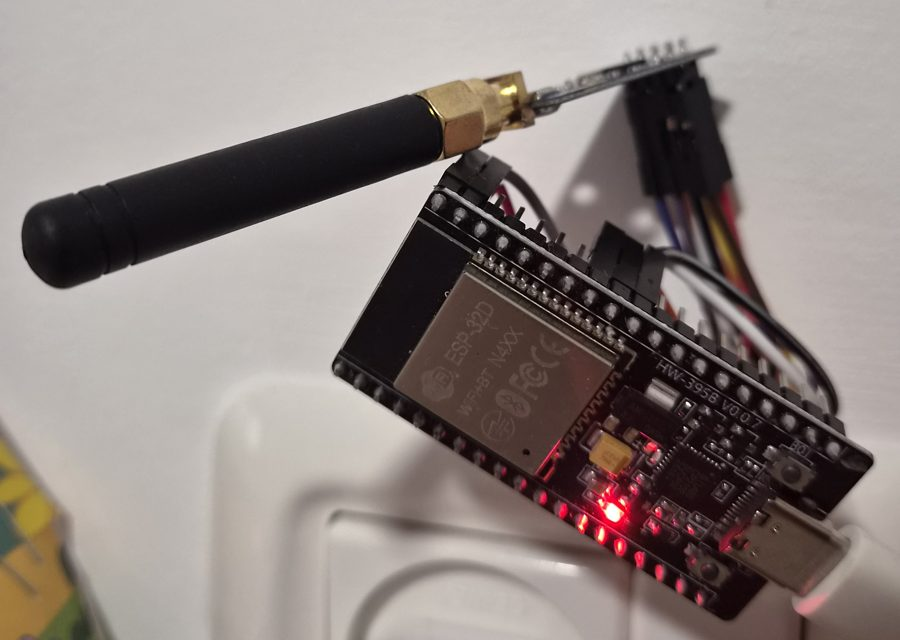
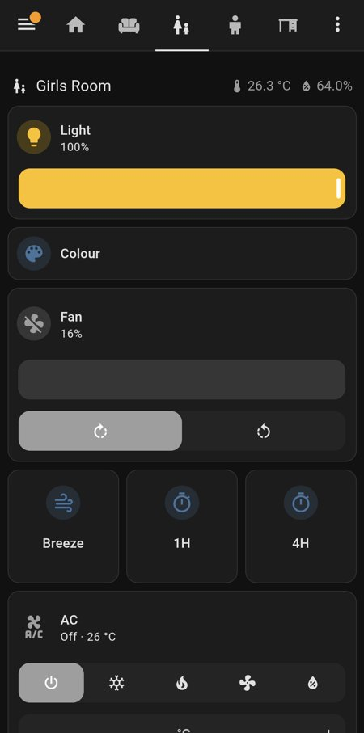
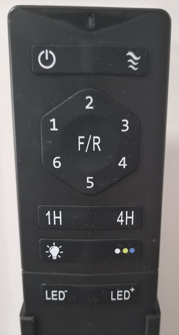

# esphome-pacific-fan

Control **Pacific ceiling fans** (433.92 MHz RF remotes) from Home Assistant
with an ESP32 and a CC1101. The fan, light, dimmer, direction and timers all
become Home Assistant entities, and the original remotes keep working: the
controller listens to them and keeps Home Assistant in sync.

Based on [sha1cybr/esp32-cc1101-rf-caprep](https://github.com/sha1cybr/esp32-cc1101-rf-caprep)
by Shai Dvash - see [Credits](#credits).

<p align="center">
  
  &nbsp;
  
</p>

## Tested with



**Pacific Strong 42" CCT** DC ceiling fans with the LED light and the
15-button remote (sold in Israel by מחסני תאורה, SKU 75372015). Other Pacific
models with a similar remote are likely to work; if yours does not, see
[Other fans](#other-fans).

If your remote looks like this one - power and breeze on top, speeds 1-6
around F/R, 1H / 4H timers, light and colour, LED- / LED+ - it is the same
family.

<br clear="right"/>

## What you get, per fan

| Entity | What it does |
|---|---|
| `fan` | On/off, 6 speeds, direction, and a **Breeze** preset |
| `light` | On/off and a brightness slider mapped onto the dimmer steps |
| `button` × 3 | Timer 1H, Timer 4H, Light colour |
| `sensor` | Minutes left on the fan's own timer |

Plus, for the whole controller: **Learn Mode** and **Last Heard** (find a
remote's address), and **Sync Only** (re-align the tracked state without
transmitting).

## Hardware

- ESP32 dev board
- CC1101 module with a 433 MHz antenna

```
ESP32 GPIO  ->  CC1101
18          ->  SCK
19          ->  MISO (SO)
23          ->  MOSI (SI)
5           ->  CSN
25          ->  GDO0   (TX data)
26          ->  GDO2   (RX data)
3V3 / GND   ->  VCC / GND
```

Any pins can be used; set them in the config (below).

## Quick start

1. Copy [examples/fan-controller.yaml](examples/fan-controller.yaml) and create
   a `secrets.yaml` next to it with `wifi_ssid`, `wifi_password`, `api_key`
   (generate one with `openssl rand -base64 32`) and `ota_password`. Leave
   `fans:` empty (`fans: []`) if you don't know your addresses yet.
2. Flash it: `esphome run fan-controller.yaml`, and add the device in Home
   Assistant (Settings → Devices & Services → ESPHome).
3. **Find each remote's address**: on the device's page in Home Assistant,
   turn on **Learn Mode** and press any button on the remote. The **Last
   Heard** sensor shows exactly what to put in the config:
   ```
   address: 0xE5D7C, parity: even  (Power)
   ```
   Repeat for each remote. (The same thing is in the device log as a `LEARN`
   line.) Turn Learn Mode off when done.
4. Add one entry per fan and flash again:
   ```yaml
   pacific_fan:
     fans:
       - name: Bedroom
         address: 0xE5D7C
         parity: even
   ```
5. **Calibrate once**: the controller cannot ask a fan what it is doing, so
   tell it. Turn on **Sync Only**, set the fan and light entities to match the
   room, turn Sync Only off.

The component is loaded straight from this repository:

```yaml
external_components:
  - source: github://meirhalachmi/esphome-pacific-fan
    components: [pacific_fan]
```

## Configuration

```yaml
pacific_fan:
  id: fan_radio          # optional, for id(fan_radio).send(address, command)
  sck_pin: 18            # all pins optional, defaults shown
  miso_pin: 19
  mosi_pin: 23
  cs_pin: 5
  gdo0_pin: 25
  gdo2_pin: 26
  learn_mode:            # optional, rename or hide the switches
    name: Learn Mode
  sync_only:
    name: Sync Only (no RF)
  last_heard:
    name: Last Heard
  fans:
    - name: Bedroom      # prefix for every entity of this fan
      address: 0xE5D7C   # 20-bit remote address, from Learn Mode
      parity: even       # even | odd, from Learn Mode
      dim_steps: 8       # optional, how many steps the dimmer has
      # Every entity can be customised, e.g.:
      # fan:   { name: Bedroom Ceiling Fan, icon: mdi:ceiling-fan }
      # light: { name: Bedroom Ceiling Light }
      # timer_1h / timer_4h / colour / timer_remaining: { ... }
```

## Dashboard

[examples/dashboard-room-view.yaml](examples/dashboard-room-view.yaml) is a
ready-made Home Assistant view for one room (light, fan with quick actions,
optionally the AC) - the one in the screenshot above. Replace the entity prefix and paste it under `views:` in
the dashboard's raw configuration editor, once per room.

## How it works

**The protocol.** Each press sends a 30-bit PWM-OOK frame, most significant
bit first: 20-bit address, 9-bit command, 1 check bit. A `1` is a ~1090 µs mark
and a ~375 µs space, a `0` the reverse; frames repeat ~9 times with a ~5.6 ms
gap, and each press is keyed twice ~200 ms apart. The check bit makes the count
of ones even on some remotes and odd on others, hence `parity:` per fan.

| Button | Command | Button | Command |
|---|---|---|---|
| Power (toggle) | `0x191` | F/R (toggle) | `0x12B` |
| Breeze | `0x10B` | Timer 1H | `0x095` |
| Speed 1 | `0x1E8` | Timer 4H | `0x152` |
| Speed 2 | `0x1C8` | Light (toggle) | `0x1B1` |
| Speed 3 | `0x1A9` | Light colour | `0x1D0` |
| Speed 4 | `0x189` | LED- | `0x0F4` |
| Speed 5 | `0x16A` | LED+ | `0x133` |
| Speed 6 | `0x14A` | | |

**Tracked state.** Power, F/R and the light are toggles and the dimmer only
steps, so the controller keeps what it believes each fan is doing (saved to
flash) and sends only what is needed to reach what Home Assistant asks for.
Turning a fan on is done with a speed command, which also switches it on, so
it never depends on guessing the toggle.

**Listening.** The CC1101 stays in receive mode. A press counts once two
identical frames agree, with the right address and check bit; everything else
is dropped. Presses on the original remotes update the entities, and the
controller stops listening while it transmits so it never hears itself.

**Details worth knowing:**
- Breeze is a mode of its own on these fans: it replaces the speed, and
  pressing a speed leaves it. So it is a preset of the fan entity - choosing
  it enters Breeze, choosing a speed leaves it, and turning the fan back on
  returns to whichever of the two it was in.
- A quick off/on of the light changes its colour on these fans, so light
  toggles from Home Assistant are kept at least 3 s apart.
- The dimmer has no absolute command. Brightness maps to an estimated step;
  going to 100% or the minimum sends a couple of extra presses so the estimate
  re-anchors.
- The fan's own timer switches it off silently; the controller follows the
  countdown and marks the fan off when it ends (not across a controller reboot).

## Other fans

If a fan does not respond, its remote may use different timings or codes.
[esphome/esphome_rf_capture.yaml](esphome/esphome_rf_capture.yaml) is a
receive-only build that logs every frame with its pulse timings; follow
[CAPTURE_PROCEDURE.md](esphome/CAPTURE_PROCEDURE.md) to map a remote.

## Troubleshooting

- **`CC1101 not detected`** in the log: check the SPI wiring and 3.3 V power.
- **Presses on the remote are not picked up**: turn on Learn Mode and check
  the frames arrive; move the antenna or the controller closer.
- **Home Assistant shows the wrong state**: recalibrate with Sync Only.
- **WiFi fails**: the device opens a fallback access point if you add `ap:`
  under `wifi:` together with `captive_portal:`.

## Credits

This project is built on
[**sha1cybr/esp32-cc1101-rf-caprep**](https://github.com/sha1cybr/esp32-cc1101-rf-caprep)
by Shai Dvash and its contributors, which it was forked from. That repository did the groundwork
this one stands on: the ESP32 + CC1101 hardware setup, the RF capture/replay
tool, the first decoding of the Pacific fan protocol (the address + command
frame and the first command codes) and the first ESPHome version. What was
added here is the full button map measured from the remote, two-way state
tracking, and packaging as an ESPHome component.

The original general-purpose Arduino capture/replay tool (`server.ino`, with
its web UI and REST API) is not part of this repository any more; it lives on
in the upstream repository.

- CC1101 driver: [CC1101-ESP-Arduino](https://github.com/wladimir-computin/CC1101-ESP-Arduino)
  (MIT), vendored in `components/pacific_fan` because ESPHome's ESP-IDF build
  rejects its library manifest.
